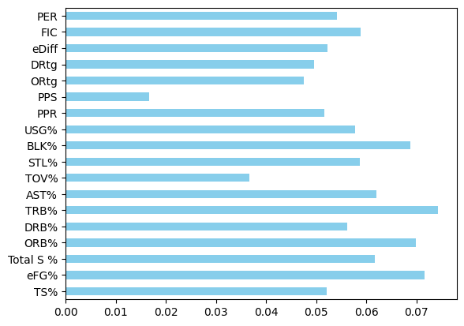

# predicting-roty-nba
Contributors: Mirza Abubacker and Shaheryar Haider

## NBA Rookie of the Year Prediction

# Overview
This repository contains a project that predicts the NBA Rookie of the Year using various technologies and data sources, including Python machine learning models, Excel and Power BI for data preprocessing, and Python web scraping with BeautifulSoup for data collection.

# Technologies Used:
    - Python: Used for data scraping, data preprocessing, and machine learning.
        - BeautifulSoup: Used for web scraping NBA player statistics from RealGM.
        - Scikit-learn: Used for machine learning and model evaluation.
        - Pandas: Used for structuring the data within Python.
        - Matplotlib: Used for graphing data. 
    - Excel: Used for data cleaning.
    - PowerBI (Power Query/DAX): Used for data cleaning, merging tables, and to overview the statistical summary (min, max, variance, avg) and NULL values in the data. 
    - Visual Studio: Used for development and documenting code.

# Data Sourcing
Embarking on our machine learning journey, we recognized the need for an extensive dataset to power our models. Our quest led us to various basketball statistics websites, each offering comprehensive data on college basketball players, including advanced stats crucial for our analysis. However, the challenge arose when none of these platforms provided the option to export data in our desired format, prompting us to delve into the world of web scraping.

Our decision to accumulate a decade's worth of data stemmed from a delicate balance – sufficient for robust analysis yet manageable for effective cleaning and organization. Opting for RealGM as our primary data source, we set out to craft a web scraping solution using BeautifulSoup.

```
from bs4 import BeautifulSoup
import requests
import time 
import csv
import pandas as pd
import numpy as np


years = range(2012,2023)
pages = range(1,5)

mydata = pd.DataFrame()

```
We imported the necessary libraries and assigned data to variables that we would need to use in our webscraping model. We also assigned a pandas dataframe to get started. 

```
for year in years:

    for page in pages:
    
        headers = []

        source = requests.get(f'https://basketball.realgm.com/ncaa/stats/{year}/Averages/Qualified/All/Season/All/points/desc/{page}/').text

        soup = BeautifulSoup(source, 'lxml')
        player_info = soup.find('table')

        for header in player_info.find_all('th'):
            title = header.text
            headers.append(title)
        
        year_data = []

        for j in player_info.find_all('tr')[1:]:
            row_data = j.find_all('td')
            row = [header.text for header in row_data]
            year_data.append(row)

        year_df = pd.DataFrame(year_data, columns=headers)
        year_df['Year'] = year

        mydata = mydata.append(year_df,ignore_index=True)
        mydata.drop('#', inplace=True, axis=1)
        

    mydata.to_csv(f'college_reg_stats.csv', index=False)
    print(mydata)
```
Our webscraping model is encased in a for loop that iterates through pages on the RealGM website. After adding the RealGM link to our Source variable we called on the BeautifulSoup function to find html lines with the 'th' tag as this contained data within the tables on the page. You can also see how we created our column names using the headers.append function.  

Another for loop allowed us to iterate through each row in the table looking for additional tags such as 'tr' and 'td' to specify the data that we wanted. Then, we appended each scan and added it to our data frame. Finally we exported this data to a csv file, allowing us to get started on the machine learning model of this project. 

# Model Training and Evaluation
We used the Random Forest Classifier as our method of machine learning for this model. The reason we used a classifier model is because our target variable being 'Ranking' (1-5) is a categorical variable. 

```
# Load the data from the CSV file
data = pd.read_csv(r'C:\Users\abmir\Desktop\nba_ROTY_predictor\data.csv')

# Display the first few rows of the dataset to understand its structure
print(data.head())

# print(data['Ranking'].value_counts())

# Select features (X) and target variable (y)
# In this case, let's use all columns except 'Player Name', 'Ranking', and 'Year' as features
X = data.drop(['Player Name', 'Ranking', 'Year','College Year','Team'], axis=1)
y = data['Ranking']

# Split the data into training and testing sets (70/30 split)
X_train, X_test, y_train, y_test = train_test_split(X, y, test_size=0.3, random_state=42)

# Initialize a RandomForestClassifier for multi-class classification
model = RandomForestClassifier(n_estimators=100, random_state=42)
```
We first loaded our data frame using the Pandas library from the csv file. To ensure our data looked good, we used the .head function to get a peek at what our data looks like. This ensured that every time we ran the code, we could make sure that we were working with the right data. Then we dropped attributes from our dataset that would not contribute anything to the model, such as: 'Player Name', 'Year', 'College Year', and 'Team'. This list also incudes 'Ranking' but that is only because it is our target variable, which you will see in the next line we added to our y/target variable in the code.  

As with all machine learning models, we split the data into training and test data. We chose to use the 70/30 split as it is a common and standard split ratio used by most models. As mentioned before, we used the Random Forest Classifier model with an n_estimator value of 100 and a random seed of 42.  

```
# Train the model on the training set
model.fit(X_train, y_train)

feature_importances = pd.Series(model.feature_importances_, index=X_train.columns)

print(feature_importances)

transpose_fi = feature_importances.T

#making histogram for feature importances
transpose_fi.plot(kind='barh', legend=False, color='skyblue')
plt.show()

# Make predictions on the testing set
predictions = model.predict(X_test)

# Evaluate the accuracy and other metrics of the model
accuracy = accuracy_score(y_test, predictions)
print(f'Model Accuracy: {accuracy}')

# Additional classification metrics
precision = precision_score(y_test, predictions, average='weighted')
recall = recall_score(y_test, predictions, average='weighted')
f1 = f1_score(y_test, predictions, average='weighted')

print(f'Precision: {precision}')
print(f'Recall: {recall}')
print(f'F1-Score: {f1}')
print(classification_report(y_test, predictions))
```
We fit the data into the model and ran a feature_importances calculation to get a good look at our attribute's contribution to the prediction. We then visualized this data using matplotlib's horizontal histogram graph, which you will see in the 'Findings' section below. Afterwards we ran some test metrics to evaluate the performance of our model on the test data. You can also find the scores of these results in the 'Findings' section below. 

# Challenges
During the course of our project, we encountered several challenges and obstacles that demanded creative solutions. In particular, we dealt with incomplete data, outliers, and intermittent code breaks. Addressing these issues required a combination of resourceful problem-solving and collaborative efforts.  

Dealing with incomplete data necessitated sourcing information from various key repositories to bridge the gaps in our dataset. Additionally, encountering code breaks and errors prompted us to leverage platforms like Stack Overflow, enabling us to troubleshoot and rectify issues efficiently.  

One of the most formidable challenges we encountered during the data cleaning process centered around discrepancies in player names. We encountered instances of extraneous spaces within the data, which we promptly resolved using the Trim function to ensure consistency. Furthermore, complications arose with European names containing accents and symbols that the CSV file struggled to accurately record, resulting in unexpected symbols replacing certain letters. This issue was successfully mitigated by replacing these European characters with their closest plain English counterparts, effectively resolving the problem and ensuring data integrity.  
  
# Findings


We find that TRB% (Total Rebound Percentage) has the highest importance value in this model, followed by eFG% (Effective Field Goal Percentage) telling us that the model puts importance on forwards for winning ROTY awards. 

Honorable mentions go to the next three advanced stats: ORB% (Offensive Rebound Percentage), BLK% (Blocks Percentage), and AST% (Assists Percentage)

# License
This project is licensed under the MIT License. Feel free to use, modify, and distribute the content, but ensure you comply with the terms of the license.

